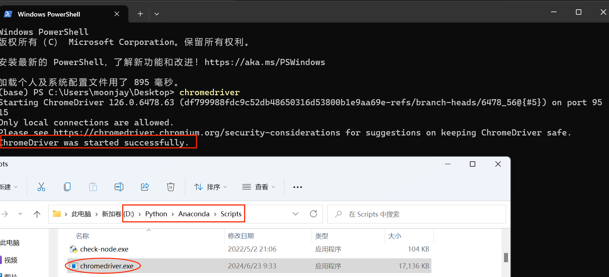
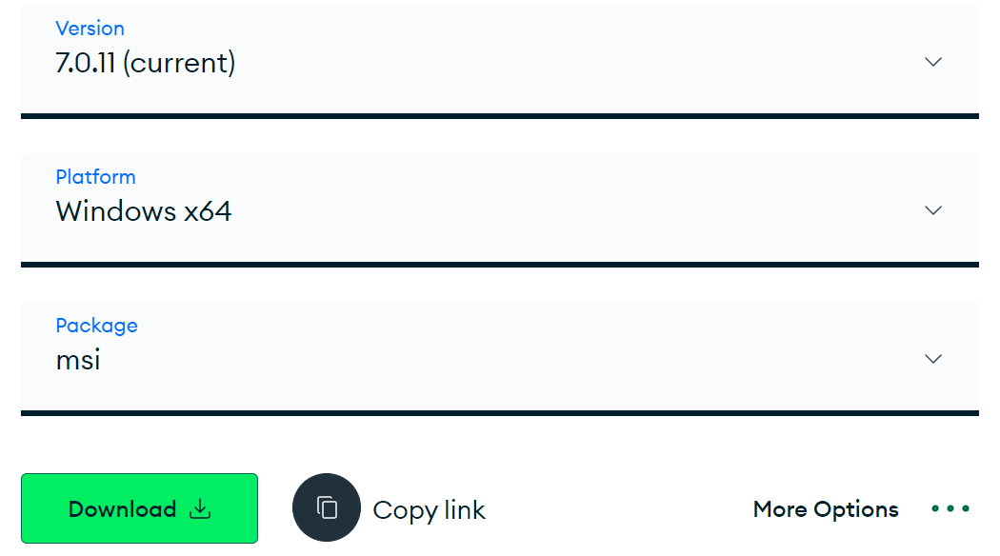
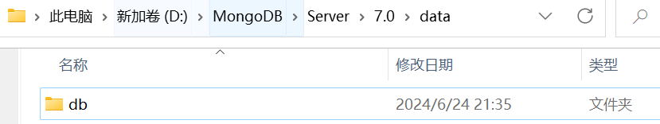
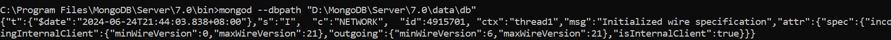

# 环境配置

## 请求库的安装
爬虫可以简单分为几步：抓取页面、分析页面和存储数据。 

在抓取页面的过程中，需要模拟浏览器向服务器发出请求，所以需要用到一些 Python 库来实现 HTTP 请求操作。

在本项目中，我们用到的第三方库有 `requests`、`Selenium` 和 `aiohttp` 等。

### requests 库
> 官方文档：http://www.python-requests.org

### Selenium 库
Selenium 是一个自动化测试工具，利用它我们可以驱动浏览器执行特定的动作，如点击、下拉等操作。

对于一些 JavaScript 渲染的页面来说，这种抓取方式非常有效。

> - 官方网站：http://www.seleniumhq.org
> - GitHub：https://github.com/SeleniumHQ/selenium/tree/master/py
> - PyPI：https://pypi.python.org/pypi/selenium
> - 官方文档：http://selenium-python.readthedocs.io

但这样做还不够，因为还需要用浏览器（如 Chrome、Firefox 等）来配合 Selenium 工作。

后面会介绍 Chrome、Firefox、PhantomJS 三种浏览器的配置方式。有了浏览器，我们才可以配合 Selenium 进行页面的抓取。

### ChromeDriver 安装
只有安装 ChromeDriver，才能驱动 Chrome 浏览器完成相应的自动化操作。
> - 官方网站：https://developer.chrome.com/docs/chromedriver/downloads

点击 Chrome 菜单 “帮助”→“关于 Google Chrome”，即可查看 Chrome 的版本号，如图所示。

**这里我的 Chrome 版本是 126.0**，牢记 Chrome 版本号，因为选择 ChromeDriver 版本时需要用到。
> - 下载链接：https://storage.googleapis.com/chrome-for-testing-public/126.0.6478.63/win64/chromedriver-win64.zip

下载完成后，将 ChromeDriver 的可执行文件配置到环境变量下。
> 在 Windows 下，建议直接将 `chromedriver.exe` 文件拖到 Python 的 **Scripts** 目录下



**验证安装**
- 终端执行
    ```bash
  chromedriver
    ```
- python 脚本
    ```python
  from selenium import webdriver
  browser = webdriver.Chrome()
    ```
运行之后，如果弹出一个空白的 Chrome 浏览器页面，则证明所有的配置都没有问题。

如果弹出后闪退，则可能是 ChromeDriver 版本和 Chrome 版本不兼容，需要更换 ChromeDriver 版本。

### ~~PhantomJS 的安装~~
~~PhantomJS 是一个无界面的、可脚本编程的 WebKit 浏览器引擎，它原生支持多种 Web 标准：DOM 操作、CSS 选择器、JSON、Canvas 以及 SVG。~~

~~Selenium 支持 PhantomJS，这样在**运行的时候就不会再弹出浏览器页面**了。而且 PhantomJS 的运行效率也很高，还支持各种参数配置，使用方便。~~

> - 官方网站：http://phantomjs.org
> - 官方文档：http://phantomjs.org/quick-start.html
> - 下载地址：http://phantomjs.org/download.html
> - API 接口说明：http://phantomjs.org/api/command-line.html
> ---
> **Selenium新版本已经放弃PhantomJS，建议使用Chrome的Headless版本代替**

~~下载的文件解压之后并打开，会看到一个 **bin** 文件夹，里面包括一个可执行文件 `phantomjs.exe`。~~

~~需要将它直接**放在配置好环境变量的路径下或者将它所在的路径配置到环境变量里**。~~
> - ~~将它直接复制到 Python 的 **Scripts** 文件夹~~
> - ~~将它所在的 **bin** 目录加入到环境变量。~~

~~**验证安装**~~
```bash
phantomjs
```

### aiohttp 的安装
requests 库是一个阻塞式 HTTP 请求库，当我们发出一个请求后，程序会一直等待服务器响应，直到得到响应后，程序才会进行下一步处理。

这个过程比较耗费时间。如果程序可以在这个等待过程中做一些其他的事情，如进行请求的调度、响应的处理等，那么爬取效率一定会大大提高。

aiohttp 就是这样一个提供异步 Web 服务的库，从 Python 3.5 版本开始，Python 中加入了 `async/await` 关键字，使得回调的写法更加直观和人性化。

aiohttp 的异步操作借助于 `async/await` 关键字的写法变得更加简洁，架构更加清晰。

> - 官方文档：https://docs.aiohttp.org/en/stable/
> - GitHub：https://github.com/aio-libs/aiohttp
> - PyPI：https://pypi.python.org/pypi/aiohttp

后面的实例中用到这个库，比如**维护一个代理池时，利用异步方式检测大量代理的运行状况，会极大地提升效率**。

## 解析库的安装
抓取网页代码之后，下一步就是从网页中提取信息。提取信息的方式有多种多样，可以使用正则来提取，但是写起来相对比较烦琐。

有许多强大的解析库，如 `lxml`、`BeautifulSoup`、`pyquery` 等。

此外，还提供了非常强大的解析方法，如 **XPath 解析**和 **CSS 选择器解析**等。

### lxml 的安装
`lxml` 是 Python 的一个解析库，支持 HTML 和 XML 的解析，支持 XPath 解析方式，而且解析效率非常高。
> - 官方网站：http://lxml.de
> - GitHub：https://github.com/lxml/lxml
> - PyPI：https://pypi.python.org/pypi/lxml

### BeautifulSoup 的安装
`BeautifulSoup` 是 Python 的一个 HTML 或 XML 的解析库，可以用它来方便地从网页中提取数据。

**`BeautifulSoup` 的 HTML 和 XML 解析器是依赖于 `lxml` 库的，所以在此之前请确保已经成功安装好了 `lxml` 库**
> - 官方文档：https://www.crummy.com/software/BeautifulSoup/bs4/doc
> - 中文文档：https://www.crummy.com/software/BeautifulSoup/bs4/doc.zh
> - PyPI：https://pypi.python.org/pypi/beautifulsoup4

### pyquery 的安装
`pyquery` 同样是一个强大的网页解析工具，它提供了和 jQuery 类似的语法来解析 HTML 文档，支持 CSS 选择器，使用非常方便。
> - GitHub：https://github.com/gawel/pyquery
> - PyPI：https://pypi.python.org/pypi/pyquery
> - 官方文档：http://pyquery.readthedocs.io

### tesserocr 的安装
在爬虫过程中，难免会遇到各种各样的验证码，而大多数验证码还是图形验证码，这时候我们可以直接用 OCR 来识别。
> OCR（Optical Character Recognition），光学字符识别，是指通过扫描字符，然后通过其形状将其翻译成电子文本的过程。
> 
> 对于图形验证码来说，它们都是一些不规则的字符，这些字符确实是由字符稍加扭曲变换得到的内容。

`tesserocr` 是 Python 的一个 OCR 识别库，但其实是对 `tesseract` 做的一层 Python API 封装，所以它的核心是 `tesseract`。

因此，在安装 `tesserocr` 之前，我们需要先安装 `tesseract`。

> - tesserocr GitHub：https://github.com/sirfz/tesserocr
> - tesserocr PyPI：https://pypi.python.org/pypi/tesserocr
> - tesseract 下载地址：http://digi.bib.uni-mannheim.de/tesseract
> - tesseract GitHub：https://github.com/tesseract-ocr/tesseract
> - tesseract 语言包：https://github.com/tesseract-ocr/tessdata
> - tesseract 文档：https://github.com/tesseract-ocr/tesseract/wiki/Documentation

安装步骤：https://gitcode.com/Germey/Python3WebSpider/blob/master/1.3-%E8%A7%A3%E6%9E%90%E5%BA%93%E7%9A%84%E5%AE%89%E8%A3%85.md

## 数据库的安装
作为数据存储的重要部分，数据库同样是必不可少的，数据库可以分为**关系型**数据库和**非关系型**数据库。

- 关系型数据库如 SQLite、MySQL、Oracle、SQL Server、DB2 等，其数据库是**以表的形式存储**； 
- 非关系型数据库如 MongoDB、Redis，它们的**存储形式是键值对**，存储形式更加灵活。

### MySQL 安装

### MongoDB 安装
MongoDB 是由 C++ 语言编写的非关系型数据库，是一个**基于分布式文件存储**的开源数据库系统，其内容**存储形式类似 JSON 对象，它的字段值可以包含其他文档、数组及文档数组**，非常灵活。

MongoDB 支持多种平台，包括 Windows、Linux、Mac OS、Solaris 等，在其官方网站 https://www.mongodb.com/download-center 均可找到对应的安装包。

> - 官方网站：https://www.mongodb.com
> - 官方文档：https://docs.mongodb.com
> - GitHub：https://github.com/mongodb
> - 中文教程：http://www.runoob.com/mongodb/mongodb-tutorial.html
 
从官方网站下载社区版：https://www.mongodb.com/try/download/community-kubernetes-operator


**MongoDB 的安装目录**: `C:\Program Files\MongoDB\Server\7.0`
> 新版本（7.0）已经不需要再进行以下这几个步骤，安装时已经创建好**data**和**logs**，服务也有相关服务

~~**MongoDB data与logs目录**: `D:\MongoDB\Server\7.0` **创建data/db** (存储数据目录)~~


~~打开命令行，进入 MongoDB 安装目录的 **bin** 目录下，运行 MongoDB 服务：~~


~~这样就启动 MongoDB 服务了。 但是如果想一直使用 MongoDB，就不能关闭此命令行了。~~

~~所以，接下来还需将 MongoDB 配置成系统服务。~~
1. ~~以管理员模式运行命令行。~~
2. ~~新建一个 mongodb.log 文件，用于保存 MongoDB 的运行日志~~
3. ~~在命令行下输入如下内容：~~ 
    ```bash
    mongod --bind_ip 0.0.0.0 --logpath"C:\MongoDB\Server\3.4\logs\mongodb.log"--logappend --dbpath"C:\MongoDB\Server\3.4\data\db"--port 27017 --serviceName"MongoDB"--serviceDisplayName"MongoDB"--install
    ```
    绑定 IP 为 0.0.0.0（即任意 IP 均可访问），指定日志路径、数据库路径和端口，指定服务名称。
4. ~~在服务管理页面查看到系统服务~~

### Redis 的安装
Redis 是一个基于内存的高效的非关系型数据库。

> - 官方网站：https://redis.io
> - 官方文档：https://redis.io/documentation
> - GitHub：https://github.com/antirez/redis
> - 中文教程：http://www.runoob.com/redis/redis-tutorial.html
> - Redis Desktop Manager：https://redis.io/insight/
> - Redis Desktop Manager GitHub：https://github.com/RedisInsight/RedisDesktopManager

## 存储库（python三方库）的安装
MySQL、MongoDB、Redis提供了存储服务，但如果想要和 Python 交互的话，还需要安装一些 Python 存储库。

如 MySQL 需要安装 PyMySQL，MongoDB 需要安装 PyMongo 等。

## Web 库的安装
Web 服务程序，比如 Flask、Django 等，可以拿它来开发网站和接口等。

在本项目中，主要使用这些 Web 服务程序来搭建一些 API 接口，供爬虫使用。

例如，维护一个代理池，代理保存在 Redis 数据库中，要将代理池作为一个公共的组件使用。

那么如何构建一个方便的平台来供我们获取这些代理呢？

最合适不过的就是通过 Web 服务提供一个 API 接口，只需要请求接口即可获取新的代理，这样做简单、高效、实用！

### Flask 安装
Flask 是一个轻量级的 Web 服务程序，简单、易用、灵活。
> - GitHub：https://github.com/pallets/flask
> - 官方文档：https://flask.palletsprojects.com/en/3.0.x/
> - 中文文档：https://docs.jinkan.org/docs/flask/

```PYTHON
from flask import Flask
app = Flask(__name__)

@app.route("/")
def hello():
    return "Hello World!"

if __name__ == "__main__":
    app.run()
```

###  Tornado 安装
Tornado 是一个支持异步的 Web 框架，通过使用非阻塞 I/O 流，它可以支撑成千上万的开放连接，效率非常高。
> - GitHub：https://github.com/tornadoweb/tornado
> - 官方文档：https://www.tornadoweb.org/en/stable/
 
**验证安装**
```PYTHON
import tornado.ioloop
import tornado.web

class MainHandler(tornado.web.RequestHandler):
    def get(self):
        self.write("Hello, world")

def make_app():
    return tornado.web.Application([(r"/", MainHandler),
    ])

if __name__ == "__main__":
    app = make_app()
    app.listen(8888)
    tornado.ioloop.IOLoop.current().start()
```
运行程序，可以发现系统在 8888 端口运行了 Web 服务，控制台没有输出内容，此时访问 http:127.0.0.1/8888，web 页面出现 Hello,world

### Django 安装
Django 是一个由 Python 编写的一个开放源代码的 Web 应用框架。 是一个高级的 Python Web 框架，用于快速开发可维护和可扩展的 Web 应用程序。

Django 本身基于 MVC 模型，即 Model（模型）+ View（视图）+ Controller（控制器）设计模式，MVC 模式使后续对程序的修改和扩展简化，并且使程序某一部分的重复利用成为可能。

## App相关爬取库安装
https://gitcode.com/Germey/Python3WebSpider/blob/master/1.7-App%E7%88%AC%E5%8F%96%E7%9B%B8%E5%85%B3%E5%BA%93%E7%9A%84%E5%AE%89%E8%A3%85.md

## 爬虫框架安装
PySpider Scrapy

### TODO

## 部署相关库的安装
大规模抓取数据会用到分布式爬虫。
> 分布式爬虫需要多台主机，每台主机有多个爬虫任务，但是源代码其实只有一份。需要将一份代码同时部署到多台主机上来协同运行。

对于 Scrapy 来说，它有一个扩展组件，叫作 Scrapyd，需要安装该扩展组件，即可远程管理 Scrapy 任务，包括部署源码、启动任务、监听任务等。另外，还有 Scrapyd-Client 和 Scrapyd API 来方便地完成部署和监听操作。

Docker 集群部署。只需要将爬虫制作为 Docker 镜像，只要主机安装了 Docker，就可以直接运行爬虫，而无需再去担心环境配置、版本问题。

更多参考 - [部署相关库的安装](https://gitcode.com/Germey/Python3WebSpider/blob/master/1.9-%E9%83%A8%E7%BD%B2%E7%9B%B8%E5%85%B3%E5%BA%93%E7%9A%84%E5%AE%89%E8%A3%85.md)